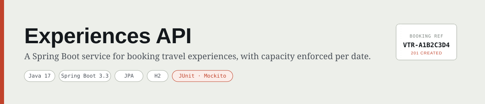
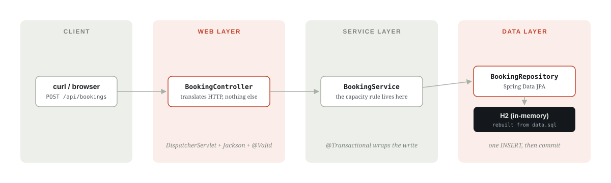

# Experiences API

A small backend service for browsing travel experiences and booking a place on one. Each experience has a daily capacity, and the API makes sure bookings never go over it.

## What it does

- Lists experiences, with optional filters for city and price
- Checks how many places are left on a given date
- Creates a booking — rejected with a clear error if the date is full
- Cancels a booking, which frees the places back up 

## How it's built

Client requests come in through a controller, business rules live in a service, and a repository talks to the database:



## Tech stack

- **Java 17** + **Spring Boot 3** (Web, Data JPA, Validation)
- **H2** — in-memory database, seeded fresh on every start
- **JUnit 5**, **Mockito**, **MockMvc** for testing

## Running it

```bash
mvn spring-boot:run
```

The app starts at `http://localhost:8080`. Nothing to install — the database lives in memory and resets on restart.

```bash
mvn test
```

## API

| Method | Path | Does |
|---|---|---|
| `GET` | `/api/experiences` | List experiences |
| `GET` | `/api/experiences/{id}` | Get one experience |
| `GET` | `/api/experiences/{id}/availability?date=` | Places left on a date |
| `POST` | `/api/bookings` | Create a booking |
| `GET` | `/api/bookings/{reference}` | Look up a booking |
| `DELETE` | `/api/bookings/{reference}` | Cancel a booking |

Example:

```bash
curl -X POST http://localhost:8080/api/bookings \
  -H "Content-Type: application/json" \
  -d '{
        "experienceId": 5,
        "travellerName": "Ashutosh Sharma",
        "travellerEmail": "ash@example.com",
        "partySize": 3,
        "bookingDate": "2026-09-01"
      }'
```
